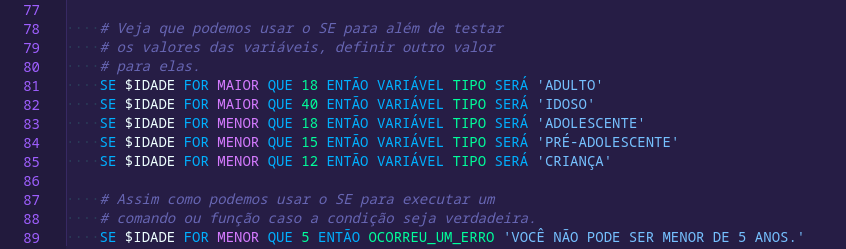

# .P

[cc-by-nc-sa]: http://creativecommons.org/licenses/by-nc-sa/4.0/
[cc-by-nc-sa-image]: https://licensebuttons.net/l/by-nc-sa/4.0/88x31.png
[cc-by-nc-sa-shield]: https://img.shields.io/badge/License-CC%20BY--NC--SA%204.0-lightgrey.svg


[**Oi, se você é a Paula** clique aqui.](PAULA.md)

**.P de Paula** é uma extensão criada para o VS Code da meta-linguagem/biblioteca criada para facilitar o processo de aprendizagem de uma criança muito especial no universo da programação.



O intuito é utilizar da flexibilidade do shellscript combinado a uma biblioteca que possibilita a escrita de algoritmos de uma forma simples e despreocupada.

Seus requisitos são unicamente **Bash 5**, **cURL**, **GIT** e o **VSCode** (_apenas para edição dos códigos e consumo da sintaxe_).

[![CC BY-NC-SA 4.0][cc-by-nc-sa-shield]][cc-by-nc-sa]

# Conteúdo e Instalação
## Contém partes móveis e peças pequenas!
_Peça para um adulto auxiliar na montagem._

Você precisa estar minimamente familiarizado com o terminal para executar os seguintes comandos:

```sh
git clone git@github.com:jmurowaniecki/P.git ~/.vscode/extensions/
```

A extensão de linguagens já está instalada. Para configurar a biblioteca da linguagem execute o seguinte comando:
```sh
ln -s ~/.vscode/extensions/P/src/tradutor ~/.local/bin/tradutor
```

> Certifique-se de que seu `~/.local/bin` esteja devidamente cadastrado na variável de ambiente `PATH`.
> 
> Caso não esteja atualize seu `~/.bashrc` incluindo o trecho a seguir no final do arquivo:
>
> ```sh
> export PATH="${PATH}:~/.local/bin"
> ```


---

This work is licensed under a
[Creative Commons Attribution-NonCommercial-ShareAlike 4.0 International License][cc-by-nc-sa].
