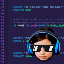

#  .P de Paula v1

[cc-by-nc-sa]: http://creativecommons.org/licenses/by-nc-sa/4.0/
[cc-by-nc-sa-image]: https://licensebuttons.net/l/by-nc-sa/4.0/88x31.png
[cc-by-nc-sa-shield]: https://img.shields.io/badge/License-CC%20BY--NC--SA%204.0-lightgrey.svg


**.P de Paula** é uma extensão criada para o VS Code com o intuito de prover uma meta-linguagem/biblioteca, pensada para facilitar o processo de aprendizagem de crianças no universo da programação.


A ideia aqui foi utilizar da flexibilidade do shellscript combinado a uma biblioteca que possibilita a escrita de algoritmos de uma forma simples e despreocupada - ao mesmo tempo que é livre e introduz certos elementos ao repertório de ferramentas do programador.

Seus requisitos são unicamente **Bash 5**, **cURL**, **GIT** e o **VSCode** (_apenas como facilitado ded edição dos códigos e consumo da sintaxe_).

[![CC BY-NC-SA 4.0][cc-by-nc-sa-shield]][cc-by-nc-sa]

# Conteúdo e Instalação

##  Contém partes móveis e peças pequenas!
> "_Corre lá e pede para um adulto auxiliar na montagem! Chama o irmão mais velho, o pai, o tio, o professor, pois acho que para apertar esses parafusos vamos precisar de uma ajudinha!_"

## Configuração usando VSCode (preferível) :tada: 
Para instalar a extensão via VSCode siga as instruções contidas no próprio [Marketplace do Visual Studio](https://marketplace.visualstudio.com/items?itemName=CompilouIT.pdepaula), ou apenas pressione `CTRL`+`P` e cole o comando: `ext install CompilouIT.pdepaula`

É possível também instalar a extensão a partir da linha de comando executando:
> `code --install-extension CompilouIT.pdepaula`

Você também pode abrir as extensões e procurar por `P de Paula`, que a extensão aparecerá na barra lateral.


## Configuração usando Git

Você precisa estar minimamente familiarizado com o terminal para executar os seguintes comandos:

```sh
git clone git@github.com:jmurowaniecki/P.git ~/.vscode-oss/extensions/

# Note que o diretório pode ser também .vscode dependendo de como você realizou a instação do VSCode.

git clone git@github.com:jmurowaniecki/P.git ~/.vscode/extensions/
```

## Configuração do tradutor

A extensão de linguagens já está instalada. Para configurar a biblioteca da linguagem execute o seguinte comando:
```sh
ln -s ~/.vscode-oss/extensions/P/src/pdpaula ~/.local/bin/pdpaula
```

> Certifique-se de que seu `~/.local/bin` esteja devidamente cadastrado na variável de ambiente `PATH`.
> 
> Caso não esteja atualize seu `~/.bashrc` incluindo o trecho a seguir no final do arquivo:
>
> ```sh
> export PATH="${PATH}:~/.local/bin"
> ```


---

This work is licensed under a
[Creative Commons Attribution-NonCommercial-ShareAlike 4.0 International License][cc-by-nc-sa].
